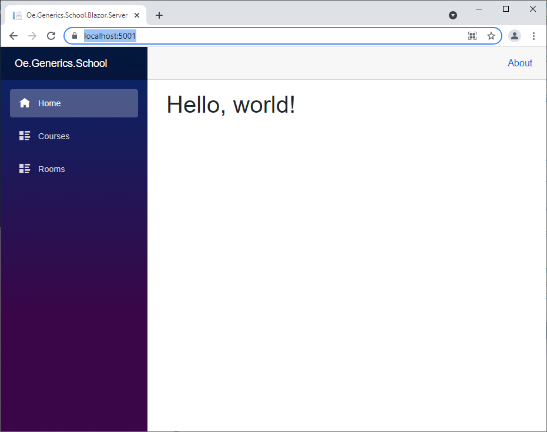
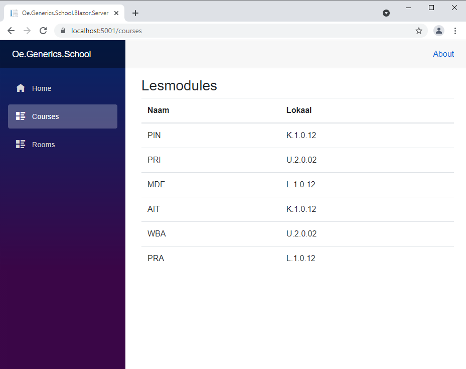
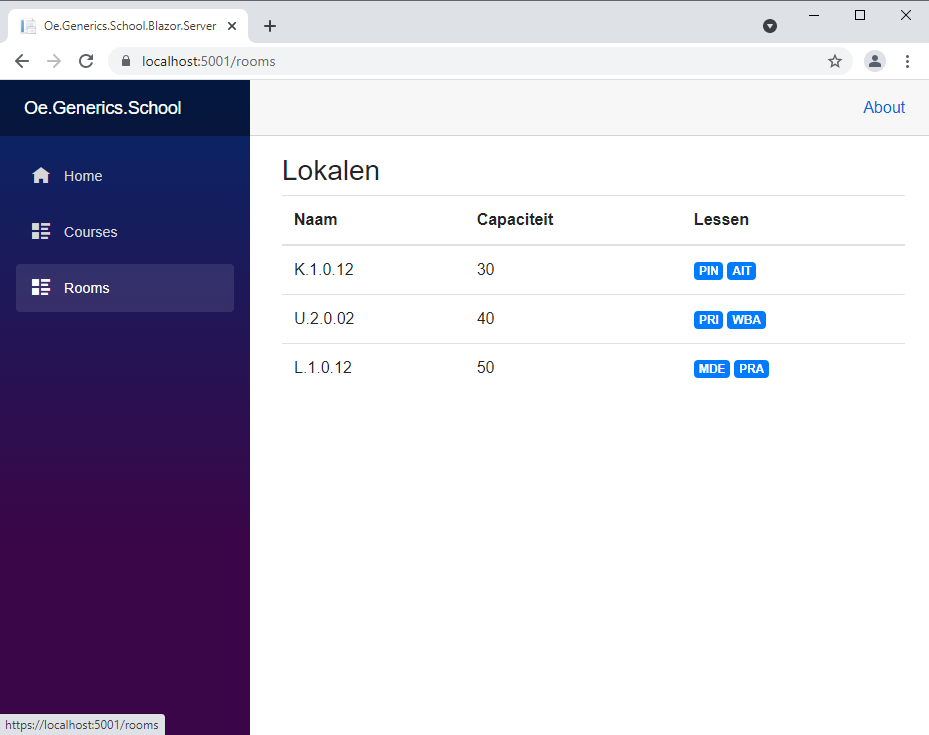
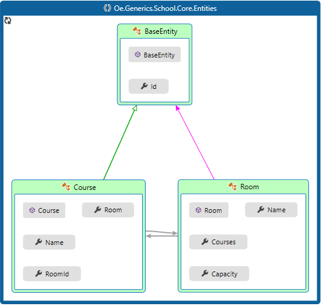
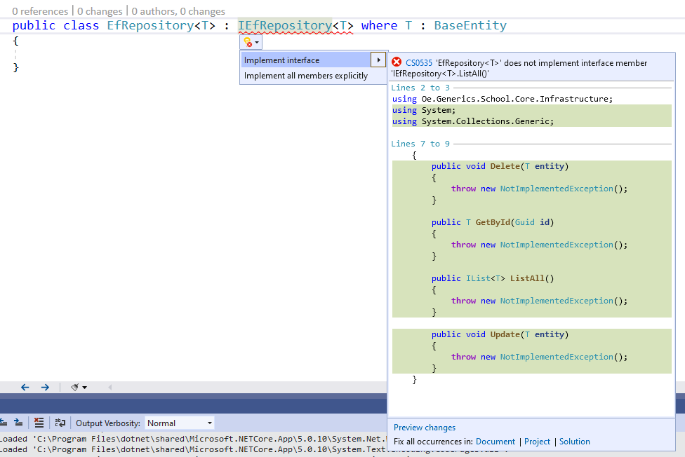

# Labo Generics

Dit labo bevat een applicatie die lokalen en lesmodules bijhoudt in een database en deze data visualiseert in een Blazor applicatie.

In dit labo gaan we twee bestaande serviceklassen en twee bestaande repositoryklassen vervangen door een generic serviceklasse en een generic repositoryklasse.

Dit labo bevat reeds volgende projecten:
- **Infrastructure**
	- bevat twee repositoryklassen (`CourseRepository` en `RoomRepository`)
	- bevat alle andere database gerelateerde klassen zoals `ApplicationDbContext`, `Migrations` folder, de nodige seeding, ...
- **Core**
	- bevat de nodige entities (`Room` en `Course`)
	- bevat twee interfaces voor de serviceklassen (`IRoomService` en `ICourseService`)
	- bevat twee implementaties voor de serviceklassen (`RoomService` en `CourseService`)
		- In de `RoomService` klasse wordt de `IRoomRepository` geïnjecteerd via de constructor `RoomService(IRoomRepository roomRepository`)
		- In de `CourseService` klasse wordt de `ICourseRepository` geïnjecteerd via de constructor `CourseService(ICourseRepository courseRepository`)
	- bevat twee interfaces voor de repositoryklassen (`IRoomRepository` en `ICourseRepository`)
- **Blazor Server**
	- bevat een Blazor Server web applicatie
	- doet enkel dienst als UI laag
	- deze UI laag kan evengoed een MVC-, WPF-, ... project zijn
	- in de `Startup` klasse is de nodige configuratie voor Dependency Injection reeds voorzien:

```csharp
services.AddScoped<ICourseService, CourseService>();
services.AddScoped<IRoomService, RoomService>();
services.AddScoped<IRoomRepository, RoomRepository>();
services.AddScoped<ICourseRepository, CourseRepository>();
```

## Doel labo
- Leren gebruik maken van generic klassen
- Inzicht krijgen dat klassen met een bijna identieke implementatie, maar waarin enkel het type anders is, vervangen kunnen worden door een generic class
- Inzicht verwerven waarom en hoe een methode van een generic class overruled moet worden door een eigen methode met eigen implementatie

## Start
- Clone deze git repository in een folder op je computer
- Voer het commando uit om je database up te daten (een migration dien je niet aan te maken, deze is al aanwezig in het startproject). 

> Zorg ervoor dat het commando uitgevoerd wordt vanuit de folder waarin ook je **solution file** `.sln` aanwezig is.

```powershell
dotnet ef database update -s .\Oe.Generics.School.Blazor.Server\ -p .\Oe.Generics.School.Infrastructure\
```

- Indien het nog niet het geval zou zijn, stel dan het **Blazor.Server** project in als Startup project
- Run de applicatie, indien alles goed verloopt dien je volgend scherm te zien in je browser:



- Klik even op **Courses** in het linkermenu en je zou volgend scherm moeten zien:



- Klik even op **Rooms** in het linkermenu en je zou volgend scherm moeten zien:



Zoals je ziet een werkende applicatie.

> **Merk op!**
> 
> Wanneer we de courses opvragen zien we ook de rooms en wanneer we de rooms opvragen zien we ook de courses die daar gegeven worden.


## Klassen structuur


- BaseEntity
	- abstract
	- bevat een property `Id` van het type `Guid`
- Course
	- Erft over van `BaseEntity`
	- Bevat een `Name` property van het type `string`
	- Bevat een navigation property `Room` van het type `Room`
	- Bevat de foreign key voor de `RoomId` van het type `Guid`
- Room
	- Erft over van `BaseEntity`
	- Bevat een `Name` property van het type `string`
	- Bevat een `Capacity` property van het type `int`
	- Bevat een navigation property `Courses` van het type `IList<Room>` collectie


## Applicatie flow
- De Blazor pages spreken de implementatie van `IRoomService` of `ICourseService` aan.
- Deze implementaties (`RoomService` of `CourseService`) spreken op hun beurt de implementatie aan van `IRoomRepository` of `ICourseRepository` aan
- Deze implementaties (`RoomRepository` of `CourseRepository`) spreken op hun beurt de instantie van `ApplicationDbContext` aan
- De opgevraagde data keert de omgekeerde weg terug

## Repository interfaces
Wanneer we kijken naar de code van de `IRoomRepository` en de `ICourseRepository` interfaces zien we volgende code:

```csharp
public interface IRoomRepository
{
    IList<Room> ListAll();
    Room GetById(Guid id);
    void Delete(Room room);
    void Update(Room room);
}

public interface ICourseRepository
{
    IList<Course> ListAll();
    Course GetById(Guid id);
    void Delete(Course course);
    void Update(Course course);
}
```

We merken op dat alle methodenamen in beide interfaces voorkomen, maar enkel het type (`Room` of `Course`) verschilt.

We kunnen deze interface gemakkelijk vervangen door een generic interface.

## IEfRepository interface
- Maak in het **Core** project een nieuwe interface aan met de naam `IEfRepository`
- maak deze interface `public`
- maak deze **generic** door er `<T>` aan toe te voegen

```csharp
public interface IEfRepository<T>
```

- voorzie een constraint dat enkel klassen mogen meegegeven worden die `BaseEntity` als base class hebben

```csharp
public interface IEfRepository<T> where T : BaseEntity
```

- plak even de methodes vanuit een andere interface (in dit voorbeeld van de IRoomRepository) in de `IEfRepository`

```csharp
public interface IEfRepository<T> where T : BaseEntity
{
    IList<Room> ListAll();
    Room GetById(Guid id);
    void Delete(Room room);
    void Update(Room room);
}
```

- Voorzie, indien nodig, de nodige using statements
- Vervang nu overal `Room` door `T`
- Vervang nu overal `room` door een meer generiekere naam, bijvoorbeeld: `entity`

```csharp
public interface IEfRepository<T> where T : BaseEntity
{
    IList<T> ListAll();
    T GetById(Guid id);
    void Delete(T entity);
    void Update(T entity);
}
```

Hiermee is onze eerste generieke interface gemaakt! Nu voorzien we nog een nieuwe generic klasse die onze interface kan implementeren.

## EfRepository klasse
Wanneer we kijken naar de code van de `RoomRepository` en de `CourseRepository` klassen zien we ook hier dat bijna alle code identiek is op het type (`Room` of `Course`) na.

- Maak een nieuwe klasse aan met de naam `EfRepository` in het **Infrastructure** project
- maak deze `public`
- maak deze generic
```csharp
public class EfRepository<T>
```
- laat deze klasse de generic interface `IEfRepository<T>` implementeren
```csharp
public class EfRepository<T> : IEfRepository<T>
```
- voeg ook hier dezelfde constraint toe
```csharp
public class EfRepository<T> : IEfRepository<T> where T : BaseEntity
```

- Implementeer nu de interface methoden van `IEfRepository` in `EfRepository` door te kiezen voor **Implement interface**



Je klasse zou er nu zo moeten uitzien:

```csharp
public class EfRepository<T> : IEfRepository<T> where T : BaseEntity
{
    public void Delete(T entity)
    {
        throw new NotImplementedException();
    }

    public T GetById(Guid id)
    {
        throw new NotImplementedException();
    }

    public IList<T> ListAll()
    {
        throw new NotImplementedException();
    }

    public void Update(T entity)
    {
        throw new NotImplementedException();
    }
}
```

Tijd om onze methodes uit te werken!

### ApplicationDbContext injecteren
- Maak een `protected readonly ApplicationDbContext _dbContext` field aan:

```csharp
protected readonly ApplicationDbContext _dbContext;
```

- Maak een constructor aan die een ApplicatonDbContext parameter ontvangt:

```csharp
public EfRepository(ApplicationDbContext dbContext)
{

}
```

- Wijs de parameter van de constructor toe aan het field:

```csharp
public EfRepository(ApplicationDbContext dbContext)
{
	_dbContext = dbContext;
}
```

- Je klasse zou er nu zo moeten uitzien:

```csharp
public class EfRepository<T> : IEfRepository<T> where T : BaseEntity
    {
        protected readonly ApplicationDbContext _dbContext;

        public EfRepository(ApplicationDbContext dbContext)
        {
            _dbContext = dbContext;
        }

        public void Delete(T entity)
        {
            throw new NotImplementedException();
        }

        public T GetById(Guid id)
        {
            throw new NotImplementedException();
        }

        public IList<T> ListAll()
        {
            throw new NotImplementedException();
        }

        public void Update(T entity)
        {
            throw new NotImplementedException();
        }
    }
```
### Methodes uitwerken
- Voorzie in de `ListAll` methode volgende code:

```csharp
public IList<T> ListAll()
{
    return _dbContext.Set<T>().ToList();
}
```

> We zien dat EF Core een generic methode bevat om de entity te kunnen "instellen", namelijk `Set<T>()`.

- Voorzie in de `GetById` methode volgende code:

```csharp
public T GetById(Guid id)
{
    return _dbContext.Set<T>().SingleOrDefault(t => t.Id.Equals(id));
}
```
> We zien dat de `Id` property gekend is bij `t.Id.Equals(id)`, dit komt door de `T` een **constraint** bevat die bepaalt dat `T` van een klasse dient te zijn die overerft van `BaseEntity`. De property `Id` zit dan ook in de klasse `BaseEntity`.


- Voorzie in de `Update` methode volgende code:

```csharp
public void Update(T entity)
{
    _dbContext.Set<T>().Update(entity);
    _dbContext.SaveChanges();
}
```

- Voorzie in de `Delete` methode volgende code:

```csharp
public void Delete(T entity)
{
    _dbContext.Set<T>().Remove(entity);
    _dbContext.SaveChanges();
}
```

- Je volledige code zou er nu zo moeten uitzien:

```csharp
public class EfRepository<T> : IEfRepository<T> where T : BaseEntity
{
	protected readonly ApplicationDbContext _dbContext;

	public EfRepository(ApplicationDbContext dbContext)
	{
		_dbContext = dbContext;
	}

	public void Delete(T entity)
	{
		_dbContext.Set<T>().Remove(entity);
		_dbContext.SaveChanges();
	}

	public T GetById(Guid id)
	{
		return _dbContext.Set<T>().SingleOrDefault(t => t.Id.Equals(id));
	}

	public IList<T> ListAll()
	{
		return _dbContext.Set<T>().ToList();
	}

	public void Update(T entity)
	{
		_dbContext.Set<T>().Update(entity);
		_dbContext.SaveChanges();
	}
}
```

### RoomService aanpassen
We zullen nu `RoomService` aanpassen zodat deze service klasse gebruik zal maken van onze net aangemaakte generic `IEfRepository` interface.

- open `RoomService`
- vervang `IRoomRepository` door `IEfRepository<Room>`

```csharp
private readonly IEfRepository<Room> _roomRepository;

public RoomService(IEfRepository<Room> roomRepository)
{
    _roomRepository = roomRepository;
}
```

### CourseService aanpassen
We zullen nu `CourseService` aanpassen zodat deze service klasse gebruik zal maken van onze generic `IEfRepository` interface.

- open `CourseService`
- vervang `ICourseRepository` door `IEfRepository<Course>`

```csharp
private readonly IEfRepository<Course> _courseRepository;

public CourseService(IEfRepository<Course> courseRepository)
{
    _courseRepository = courseRepository;
}
```


### Dependency Injection configureren
Onze generic interface en generic repository klasse dienen geconfigureerd worden voor DI.

Pas de `Startup` klasse aan in het **Blazor.Server** project:
```csharp
public void ConfigureServices(IServiceCollection services)
{
    services.AddDbContext<ApplicationDbContext>(options =>
        options.UseSqlServer(Configuration.GetConnectionString("DatabaseConnection")));

    services.AddRazorPages();
    services.AddServerSideBlazor();

    services.AddScoped<ICourseService, CourseService>();
    services.AddScoped<IRoomService, RoomService>();
    services.AddScoped<IRoomRepository, RoomRepository>();
    services.AddScoped<ICourseRepository, CourseRepository>();

    services.AddScoped<IEfRepository<Course>, EfRepository<Course>>();
    services.AddScoped<IEfRepository<Room>, EfRepository<Room>>();

    services.AddSingleton<WeatherForecastService>();
}
```

## Applicatie testen
Wanneer we nu onze Blazor applicatie opnieuw laten runnen en we klikken op **Courses** in het menu krijgen we een `NullReferenceException`.

Onze Blazor page wenst van `course` de properties van de navigation property `Room` uit te lezen. Maar aangezien `Room` `null` is krijgen we een `NullReferenceException`.
We wanneer één of meerdere courses opvragen wordt de `Room` property dus niet opgevuld met de nodige gegevens.

Wanneer we even terugkijken naar de `ListAll` methode van de `CourseRepository` zien we dat er `Include` methode gebruikt wordt voor de `Room` property.

```csharp
_dbContext.Courses.Include(c => c.Room).ToList();
```

Wanneer we kijken naar de `ListAll` methode van de  `RoomRepository` zien we dat er daar een `Include` gebruikt wordt voor de collectie van courses

```csharp
_dbContext.Rooms.Include(r => r.Courses).ToList();
```

Beide `ListAll` methodes hebben dus een eigen specifieke implementatie waardoor we de `ListAll` methode van de generic `EfRepository` niet kunnen gebruiken. 

We kunnen echter wel de `ListAll` methode gaan **overrulen** van de `EfRepository`. 

- pas de `ListAll` en de `GetById` methodes van `EfRepository` aan door deze `virtual` te maken zodat deze overriden worden.

```csharp
public virtual T GetById(Guid id)
```

```csharp
public virtual IList<T> ListAll()
```

## EfRepository als base class
- Open `RoomRepository`
- laat deze overerven van `EfRepository<Room>`

```csharp
public class RoomRepository : EfRepository<Room>, IRoomRepository
```
- pas de constructor aan zodat de dbContext parameter meegegeven wordt met de constructor van de base class `EfRepository<Room>`

```csharp
public RoomRepository(ApplicationDbContext dbContext) : base(dbContext)
```

- Aangezien er in de `EfRepository` base class een `ApplicationDbContext` field aanwezig is die `protected` is kunnen alle klassen die hiervan overerven gebruik maken van dit field. Hierdoor is het niet meer nodig om dit field te voorzien in de `RoomRepository`.

- Verwijder de `Update` methode
- Verwijder de `Delete` methode
- Markeer de `GetById` methode met `override`
- Markeer de `ListAll` methode met `override`
- Je `RoomRepository` zou er nu zo moeten uitzien:

```csharp
public class RoomRepository : EfRepository<Room>, IRoomRepository
{
    public RoomRepository(ApplicationDbContext dbContext) : base(dbContext)
    {
    }

    public override Room GetById(Guid id)
    {
        return _dbContext.Rooms.Include(r => r.Courses).SingleOrDefault(r => r.Id.Equals(id));
    }

    public override IList<Room> ListAll()
    {
        return _dbContext.Rooms.Include(r => r.Courses).ToList();
    }
}
```

We houden dus nog enkel de methoden over die een specifieke implementatie hebben waardoor we de generieke methoden niet kunnen gebruiken. We overriden deze dus met onze eigen methodes.

De `Update` en `Delete` methodes zijn nog altijd te gebruiken vanuit onze base class.

- Open `CourseRepository`
- laat deze overerven van `EfRepository<Course>`

```csharp
public class CourseRepository : EfRepository<Course>, ICourseRepository
```
- pas de constructor aan zodat de dbContext parameter meegegeven wordt met de constructor van de base class `EfRepository<Course>`

```csharp
public CourseRepository(ApplicationDbContext dbContext) : base(dbContext)
```

- Aangezien er in de `EfRepository` base class een `ApplicationDbContext` field aanwezig is die `protected` is kunnen alle klassen die hiervan overerven gebruik maken van dit field. Hierdoor is het niet meer nodig om dit field te voorzien in de `CourseRepository`.

- Verwijder de `Update` methode
- Verwijder de `Delete` methode
- Markeer de `GetById` methode met `override`
- Markeer de `ListAll` methode met `override`
- Je `CourseRepository` zou er nu zo moeten uitzien:

```csharp
public class CourseRepository : EfRepository<Course>, ICourseRepository
{

    public CourseRepository(ApplicationDbContext dbContext) : base(dbContext)
    {
    }

    public override Course GetById(Guid id)
    {
        return _dbContext.Courses.Include(c=>c.Room).SingleOrDefault(c => c.Id.Equals(id));
    }

    public override IList<Course> ListAll()
    {
        return _dbContext.Courses.Include(c => c.Room).ToList();
    }
}
```

We houden dus nog enkel de methoden over die een specifieke implementatie hebben waardoor we de generieke methoden niet kunnen gebruiken. We overriden deze dus met onze eigen methodes.

De `Update` en `Delete` methodes zijn nog altijd te gebruiken vanuit onze base class.

We dienen nu ook terug de Service klassen aan te passen

- open `RoomService`
- vervang `IEfRepository<Room>` door `IRoomRepository`
```csharp
private readonly IRoomRepository _roomRepository;

public RoomService(IRoomRepository roomRepository)
{
	_roomRepository = roomRepository;
}
``` 

- open `CourseService`
- vervang `IEfRepository<Course>` door `ICourseRepository`
```csharp
private readonly ICourseRepository _courseRepository;

public CourseService(ICourseRepository courseRepository)
{
    _courseRepository = courseRepository;
}
``` 

Door deze aanpassingen is de volgende configuratie voor de DI niet meer van toepassing en mogen deze twee statements dus verwijderd worden uit de `Startup` klasse van het **Blazor.Server** project:

```csharp
services.AddScoped<IEfRepository<Course>, EfRepository<Course>>();
services.AddScoped<IEfRepository<Room>, EfRepository<Room>>();
```

- Start opnieuw je Blazor applicatie op en we zien dat alles weer werkt zoals bij de start van dit labo.
